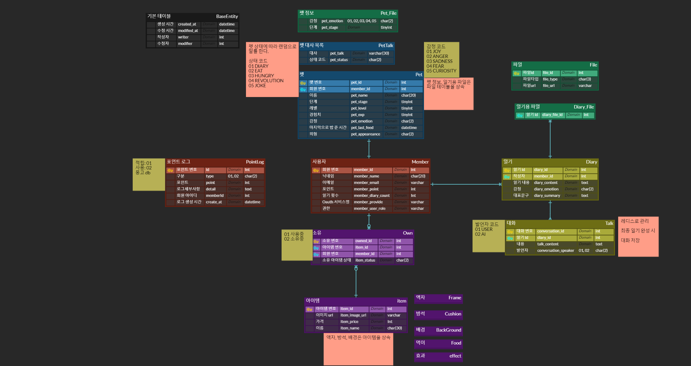
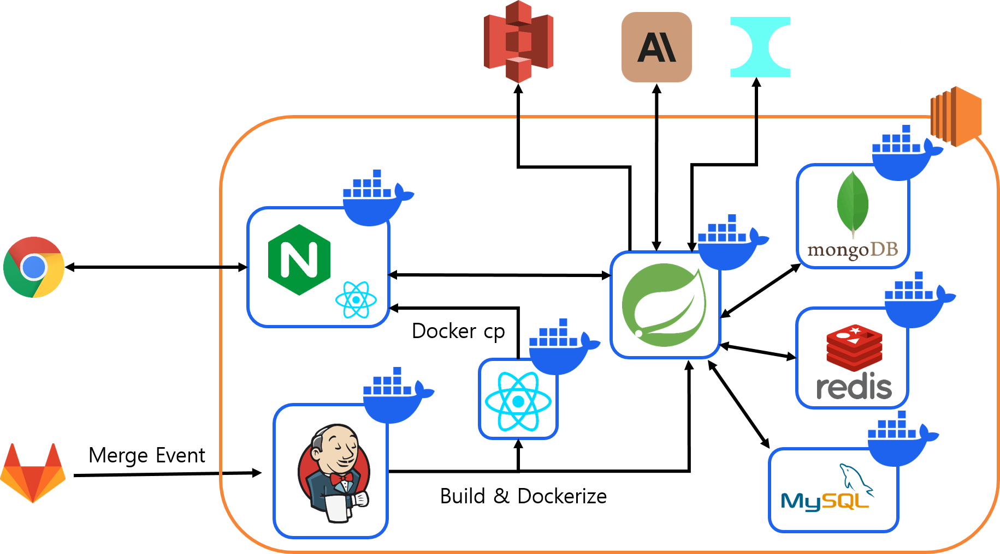

## 💬 프로젝트 소개

일기 쓰는 게 귀찮으신가요?

VODA AI와 대화만 하면 일기가 만들어집니다!

## 📚 목차

- [🎯 기획 배경](#plans)
- [🙇 팀원 소개](#members)
- [📝 설계 내용](#planning)
- [🔨 기술 스택](#skills)
- [💡 주요 기능](#features)

---

## 🎯 기획 배경

일기를 쓰는 것이 정신 건강에 좋다는 것, 많은 연구 결과가 이를 증명하며, 모두가 잘 아는 사실입니다.

그러나 뻐근한 목과 눈으로 하루 끝에 일기를 쓰는 것은 매우 힘든 일입니다.

또한 어떤 내용의 일기를 쓸 지 고민하는 것도 힘들죠.

이러한 문제를 해결하기 위해 현대인들이 간편하게 일기를 작성할 수 있는 앱을 기획하게 되었습니다.

잠들기 전, AI와 대화만 하면 일기가 작성되어 손쉽게 일상 기록을 남길 수 있도록 기획했습니다.

---

## 🙇 팀원 소개

|          [전소민(팀장)](https://github.com/goflvhxj96)          |          [김병주](https://github.com/defkimbyeongju)          |          [김진호](https://github.com/Jihn0118)           |          [여일구](https://github.com/sikutisa)           |           [박호제](https://github.com/zini9188)           |           [이수민](https://github.com/suminjeff)           |
| :---------------------------------------------------------: | :-----------------------------------------------------------: | :------------------------------------------------------: | :------------------------------------------------------: | :-------------------------------------------------------: | :--------------------------------------------------------: |
|  |  |  |  |  |  |
|                           BE, AI                            |                              FE                               |                            BE                            |                        Infra, BE                         |                          BE, AI                           |                             FE                             |

---

## 🔨 기술 스택

### 💻 Frontend

- Language: JavaScript
- Core: React 18
- Styling: Styled-Components, MUI
- State: Zustand

### 💾 Backend

- Language: Java 11
- Core: SpringBoot
- Database: MySQL, Redis, MongoDB, S3

### 🤖 AI

- Model: CLOVA, Claude, Karlo

### 🔧 CI/CD

- NginX
- Jenkins

---

## 📝 설계 내용

- [요구사항 명세서](https://docs.google.com/spreadsheets/d/1qVzVS-_9TWipgIQnEWcDtbaL983jba4cnJ_bUxw3o2I/edit#gid=843081800)

- [기능 명세서](https://docs.google.com/spreadsheets/d/1qVzVS-_9TWipgIQnEWcDtbaL983jba4cnJ_bUxw3o2I/edit#gid=1900465867)

- [와이어프레임](https://www.figma.com/file/p1LzJXdPhd24yxPtKjxmzz/WSG-WireFrame?type=design&node-id=0-1&mode=design&t=lVtegCyr2BZW7QYS-0)

- ERD

  

- 아키텍처
  

## 💡 주요 기능

### 🔑 소셜 로그인, 회원가입
간편하게 로그인 할 수 있습니다.  

### 📕 일기 작성
"오늘 하루는 어떠셨어요?" "그 때 기분은 어떠셨나요?" AI와 대화하며 하루를 기록합니다.  

### 📚 일기 목록
대화를 기반으로 자동 생성된 그림일기와 대화내역을 조회할 수 있습니다.  

### 📆 캘린더
일기에서 분석된 그날의 감정들을 한눈에 볼 수 있습니다.  

### 🐶 펫 키우기
활동 로그 기반으로 다르게 진화하는 펫을 키우며 애착을 형성할 수 있습니다.  

### 🛒 펫 상점
아이템을 구매하고 펫에게 아이템을 부여할 수 있습니다.  

### 📊 감정 통계 리포트
한 달간 작성한 일기를 다방면으로 분석한 리포트로 감정을 되돌아 볼 수 있습니다.

